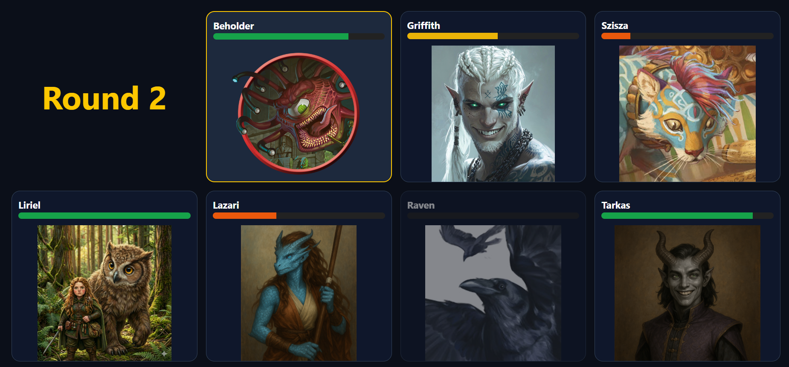
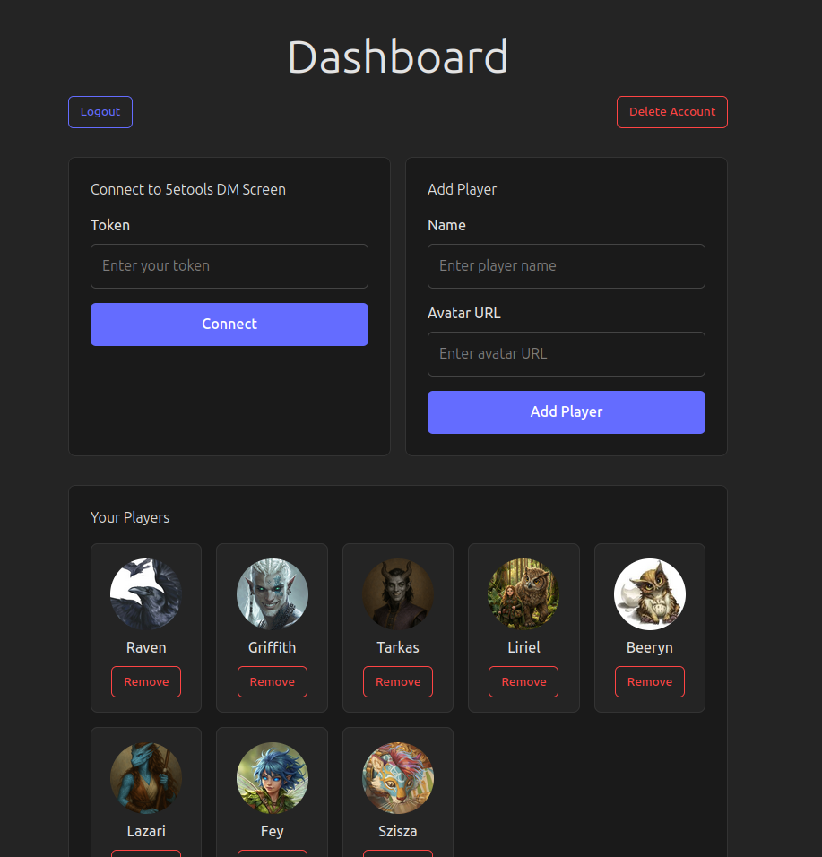
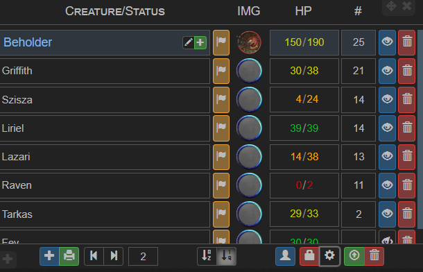

# Encountr

This tool allows you to have a displayable version for encounters tracked on [5etools DM Screen](https://5e.tools/dmscreen.html).

Using 5etools' DM Screen, you will be able to have the page display information from the encounter, such as:
- Current Round
- Current creature on turn
- Initiative order
- Health status of each player
  - If wanted, can show exact HP (see below)
- Health status of each monster
  - If wanted, can show exact HP (see below)
- Pictures for each combatant (PC and monsters)

## How To Use
### If you would like to use the local app, where you do not need to register, head over to [Local repo](https://github.com/srchd/dnd-5etools-encounter-display)

#### Dashboard:

1. Create an account (this is needed to save your players, guest mode will be coming soon)
2. Add your players:
   - Name
   - Avatar URL (currently manual uploads are not supported)
3. Go to [5etools DM Screen](https://5e.tools/dmscreen.html)
4. Add an **Initiative Tracker** element to the screen
5. Click on the  icon
6. Select Standard
7. Start Server
8. Copy token
9. Paste token in the input field at the Dashboard and press **Connect**

## Customization Options

If you do not wish to show a monster (yet), you can disable it from the display, by hiding it in 5etools' DM Screen just by clicking on the eye icon. If it is crossed, it will not show up.

By default, 5etools' DM Screen does not send the exact HP of each creature. The application will show the status of the monster and/or player
if the settings is not changed. If needed to show the exat HP, turn on these settings in the Initiative Tracker settings **(gear icon on the bottom right)**:
  - Player View: Show exact player HP
  - Player View: Show exact monster HP

**Note:** By default, players' HP is not filled out. If the DM is not tracking it on the DM Screen, it will always show like they at full health.

## Troubleshooting/FAQ:
1. Monsters are not showing:
   - Make sure that the "eye" icon is not crossed out in the DM Screen.

If you face a problem which is not detailed here, raise an issue.
